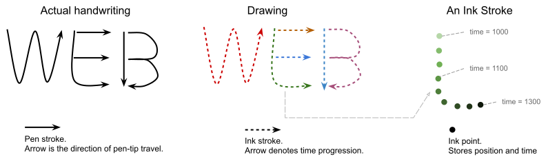

# Handwriting Recognition Explainer 

Authors: Jiewei Qian <qjw@google.com>, Matt Giuca <mgiuca@chromium.org>, Jon Napper <napper@google.com>, Tom Buckley <tbuckley@google.com>

## Overview

Handwriting is a widely used input method, one key usage is to recognize the texts when users are drawing. This feature already exists on many operating systems (e.g. handwriting input methods). However, the web platform as of today can't tap into this capability. Developers need to integrate with third-party libraries (or cloud services), or to develop native apps.

We want to add handwriting recognition capability to the web platform, so developers can use the it, which is readily available on the operating system.

This document describes our proposal for a Web Platform API for performing on-line handwriting recognition from recorded real-time user inputs (e.g. touch, stylus). This API does not aim to support recognizing handwritings in images (off-line recognition).

The term “on-line” means the API recognizes the text as the users are drawing them. Specifically, the handwriting contains temporal information (e.g. the pen-tip is at position A at time T). 

The recognizer will be able to function without the Internet, but might make use of cloud services (if available) to improve the result.

This API allow Web applications to:

1. Collect some handwriting inputs (ink strokes)
2. Request the user agent to recognize the texts
3. Retrieve the result
    *   Recognized texts as a JavaScript String
    *   Optional: Alternative results
    *   Optional: Extra information (e.g. character segmentation)


## Problem Description

Conceptually, handwriting inputs are drawings. A drawing captures the information required to recreate a pen-tip movement for text recognition purposes. Take the handwritten “WEB” for example:



*   A **drawing** consists of multiple ink strokes (e.g. the above letter E consists of three ink strokes).
*   An **ink stroke** represents one continuous pen-tip movement that happens across some time period (e.g. from one `touchstart` to its corresponding `touchend` event). The movement trajectory is represented by a series of ink points.
*   An **ink point** is an observation of the pen-tip in space and time. It records the timestamp and position of the pen-tip on the writing surface (e.g. a `touchmove` event).

The job of a handwriting recognizer is to determine the text written in a drawing. 


## Existing APIs

Here are some handwriting recognition features offered on various platforms:

### [Microsoft Windows Ink (UWP)](https://docs.microsoft.com/en-us/uwp/api/windows.ui.input.inking)

Windows Ink provides support for collecting, showing, and managing drawings, it supports both shape and text. For text recognition, there classes are used:

*   `InkPoint` and `InkStroke` store all digital ink information.
*   `InkPoint` stores: position, timestamp, pressure, and tilting angles.
*   `InkStroke` stores a list of `InkPoint`s.
*   `InkAnalyzer` recognizes texts from `InkStroke`, supports all Windows languages.
*   `InkAnalysisInkWord` includes alternative texts (candidates), bounding boxes of the text, and the composing strokes.

The handwriting recognition usage looks like the following, the text recognition result is traversed based on words. Applications can use other helper classes to streamline stroke management (e.g. `InkPresenter`).

```C#
InkStroke stroke = (new InkStrokeBuilder()).CreateStroke([
    new InkPoint(Position(x, y), pressure, tiltX, tiltY, timestamp),
    ...   // more points
]);

// Collect some strokes.
InkStroke strokes = [stroke, ...]; 

InkAnalyzer analyzer = new InkAnalyzer();
analyzer.AddDataForStrokes([inkStroke, ...]);
await analyzer.AnalyzeAsync();

// The result can be traversed based on words.
IReadOnlyList<IInkAnalysisNode> drawings = inkAnalyzer.AnalysisRoot.FindNodes(InkAnalysisNodeKind.InkWord);
for each (IInkAnalysisNode node in drawings) {
    InkAnalysisInkWord word = (InkAnalysisInkWord) word;
    word.RecognizedText;      // string, the recognized text
    word.TextAlternatives;    // list of string, alternative texts
}
```


### [Apple PencilKit](https://developer.apple.com/documentation/pencilkit)

PencilKit provides support for creating and managing ink drawings, key classes are:

*   `PKStrokePoint`, `PKStroke` and `PKDrawing` store digital ink information.
*   `PKStrokePoint` stores position, timestamp, force (pressure), tilting angles, and altitude.
*   `PKStroke` can be constructed by PKStrokePoints. It interpolates the points to form a smooth stroke path.
*   `Ink` represents the styling of the stroke (i.e. width, color, type).

Apple hasn’t disclosed a public API for online handwriting recognition. But iPadOS 14 has the capability to convert handwriting to text.


### [MyScript](https://developer.myscript.com/)  {#myscript}

MyScript is a commercial cross-platform ink SDK. It runs on Windows, iOS, Android, and Web. It requires a subscription to use, and can perform on-device recognition or acts as a cloud service.

MyScript doesn’t use the point abstraction. Instead, a stroke is represented as an object which stores separate lists for position, timestamp and pressure (all lists are of the same length).

In the simplest form, MyScript takes an input in the following form:

```JavaScript
const input = {
  width: 400,
  height: 200,
  strokeGroups: {
    strokes: {
        id: "strokeId",
        x: [100, 103, 107, 109, ...],    // x coordinate
        y: [ 50,  55,  59,  63, ...],    // y coordinate
        p: [0.5, 0.4, 0.7, 0.3, ...],    // pressure
        t: [  0,  66, 132, 198, ...]     // timestamp
    }
  },
  configuration: { /* how to perform recognition */ }
}
```

The recognition result is returned as a JSON in their MyScript JIIX format (JSON Interactive Ink eXchange), it looks like this:

```JavaScript
{
  type: "Text",
  "bounding-box": { ... },
  label: "Hello world!",    // Text as a string
  words: [ ... ],           // Information on individual words
  id: "MainBlock"
}
```

MyScript also provides helper classes and SDKs to manage stroke capture. Applications can create a DOM element as a drawing area, and let MyScript SDK handles drawing capture, rendering, and recognition.

## Proposed Usage Example

### Query Feature Support

Handwriting recognizers on different platforms have different features. Web applications can query their feature support and decide if the API is suitable for their use case.

```JavaScript
navigator.queryHandwritingRecognizerSupport('writingArea')
// => true

navigator.queryHandwritingRecognizerSupport('alternatives')
// => true

navigator.queryHandwritingRecognizerSupport('supportedLanguages')
// => ['en', 'zh']

navigator.queryHandwritingRecognizerSupport('supportedTypes')
// => ['text', 'number']
```


### Perform Recognition {#perform-recognition}

```JavaScript
// Optional hints to the recognizer.
const optionalHints = { \
  languages: [‘zh-CN’, ‘en’],  // Languages, in order of precedence \
  recognitionType: ‘text’,     // The type of content to be recognized
  inputType: ‘mouse’,          // Alternatively, “touch” or “pen”
  textContext: ‘Hello, ’,      // The text before the first stroke
  alternatives: 5,
}

// Create a handwriting recognizer.
const recognizer = await navigator.createHandwritingRecognizer({
    hints: optionalHints,
})

// Start a new drawing. 
// It’s okay to create multiple drawings from a single recognizer.
const drawing = recognizer.startDrawing()

// Create a stroke and add points. 
// The point dictionary is copied, and added to the stroke object.
stroke.addPoint({ x: 84, y: 34, t: 959.685 }) 

// We can say it’s a copy of dict
// Add a stroke to the drawing.
drawing.addStroke(stroke)

// Add more points to the stroke.
stroke.addPoint({ x: 93, y: 54, t: 1013.685 })

// Get predictions of the partial drawing.
// This will take into account both points that were added to the stroke.
await drawing.getPrediction() 
// => { text, boundingBox, candidates }

// Add a new stroke.
const stroke2 = new HandwritingStroke()
stroke2.addPoint({x: 160, y: 39, t: 1761.72})
drawing.addStroke(stroke2)

// Get all strokes. Return a list of previously added HandwritingStroke object
// references, in the same order as they were added.
drawing.getStrokes() 
// => [stroke, stroke2]

// Delete a previous stroke.
drawing.removeStroke(stroke)

// Get a new prediction.
await drawing.getPrediction()

// Complete the drawing and free up resources. Subsequent calls on the drawing
// object will throw an error.
await drawing.finish()
```


## Proposed API

### Feature Detection

Handwriting recognition can be implemented in different ways. We expect different implementations will support different features (and hints).

The `queryHandwritingRecognizerSupport` method allows Web developers to query implementation-specific features, decide whether handwriting recognition is supported, and whether it is suitable for their use case.

This method takes the query as a string, and returns the appropriate result. 

Conventionally,

*   For features expecting an enumerated list (e.g. language), the query is prefixed with "supported" to the feature name. The method returns a list of values for developers to choose from.
*   For features expecting a structured value (e.g. size of writing area), the query string is the feature name (i.e. the attribute name in the hint object). The method returns `true` if this feature is supported.
*   For unsupported features, the method returns `null`.

For example, these queries are supported in this proposal: 

* `graphemeClusterSet`
* `alternatives`
* `textContext`
* `supportedLanguages`
* `supportedRecognitionTypes`
* `supportedInputTypes`

### Coordinates

This API follows the usual Web coordinate system. A coordinate is represented by its `x` and `y` attribute.  They represent the horizontal and vertical distance from the top-left corner. The top-left corner coordinate is `(x=0, y=0)`.

A bounding box is represented by its top-left corner (`x` and `y`), `width` and `height`. The API uses `DOMRectReadOnly` when returning one bounding box.

### Time

Time (`t` attribute of an ink point) is measured as a number of milliseconds elapsed since some reference time point (e.g. `Date.now()`).

### The ink and drawing model

An **ink point** is represented by a JavaScript object that has _at least_ three attributes:

*   `x`: number, the horizontal component of its coordinate.
*   `y`: number, the vertical component of its coordinate.
*   `t`: number, a timestamp, the number of milliseconds elapsed since the starting time (e.g. when the first ink point of the drawing is captured).

An ink point can have extra attributes. For example, pen-tip pressure and angles. These attributes are optional. If they are available. recognizers may use them to improve accuracy.

The recognizer will function with only the required attributes.

An **ink stroke** is represented by a JavaScript `HandwritingStroke` object, created by the client using the constructor. The ink points in a stroke _should_ have ascending `t` attributes.

Points are added by calling `addPoint` method, which deep copies the provided point dictionary.

A **drawing** is represented by a JavaScript `HandwritingDrawing` object, created by calling recognizer’s startDrawing method. The ink strokes _should_ be in an ascending order based on their start time (the `t` attribute of their first point).

*   Strokes are added by calling `addStroke` method, which takes a `HandwritingStroke` object, and stores a reference to it.
*   Strokes can be deleted by calling `removeStroke` method, which takes a previously added HandwritingStroke object.


### Recognition hints

The recognizer _may_ accept hints to improve accuracy.

Clients can optionally provide hints (or some combinations) when creating a `HandwritingRecognizer` object. Providing unsupported hints has no effect.

We propose the following hint attributes:

* `languages`: A list of languages that the recognizer should attempt to recognize. Languages are identified by IETF BCP 47 language tags (e.g. `en`, `zh-CN`). If there’s no dedicated models for that language tag, the recognizer falls back to the macro language (zh-CN becomes zh). If the macro language is not supported, the recognizer fall back to the default language of the browser (i.e. navigator.language).
* `graphemeClusterSet`: A list of strings, each string represents a grapheme cluster (a user-visible character) that is most likely to be written. Note, this is a hint, it doesn’t guarantee that the recognizer only returns the characters specified here. Clients need to process the result if they want to filter-out unwanted characters.
* `recognitionType`: A string, the type of content to be recognized. The recognizer may use these to better rank the recognition results. It supports:
    * `email`: an email address
    * `number`: a decimal number
    * `text`: free form text in typical writing prose. It hints the input drawing represents real words. For example, a sentence in everyday speech.
    * `per-character`: treat the handwriting to be made up by individual, unrelated characters, and do not attempt to refine the ranking. For example, serial numbers, license keys.
* `inputType`: A string, identifying how are the strokes captured:
    * `touch`: Input was made with touchscreen
    * `pen`: Input was made with stylus pen
    * `mouse`: Input was made with mouse
* `textContext`: A string, the text that comes before the handwriting. This can be texts that were previously recognized, or were given as the writing context (e.g. "Write your name here:"). This is the linguistic context to help disambiguate the handwriting (e.g. “Hello <span style="text-decoration:underline;">world</span>” vs “Hello <span style="text-decoration:underline;">word</span>”).
* `alternatives`: A number, the maximum number of alternative predictions.

Hints won’t guarantee the result will satisfy these constraints. For example, proving the characters hint won’t guarantee the prediction result will only contain these characters.

### The prediction result

A **prediction result** is a JavaScript object. It _must_ contain the text attribute:

*   `text`: string, the best prediction of texts drawn in the digital ink


The prediction result _may_ contain (if the implementation choose to support):

*   `alternatives`: A list of JavaScript objects, where each object has a text field. These are the next best predictions (alternatives), in decreasing confidence order. Up to a maximum of `alternatives `(given in hints) strings. For example, the first string is the second best prediction (the best being the prediction result).


## Considerations

### Fingerprinting

The underlying handwriting recognition algorithm is a fingerprint vector, it could expose information about the device (e.g. operating system). However, this information is already available in the navigator object.

The actual handwriting (of a user) is a good way of fingerprinting the user, but it is already available for collection using canvas, so we don’t think this API will expose additional vectors for fingerprinting the user.


### Language Handling

For querying for supported languages, the implementation should only return the language tags that have dedicated (or fine-tuned) models. For example, if the implementation only has a generic English language model, it should only include "en" in supportedLanguages, even if this model works for its language variants (e.g. en-US).

If language hints aren’t provided, this API should try to recognize texts based on `navigator.languages` or user's input methods.

Web developers may provide language subtags (e.g. region and script). The implementation should interpret these tags accordingly, and fallback to the macro language if necessary. For example, the "en-AU" language tag is interpreted as “en”, if there are no dedicated recognizers for Australian English.


### Interoperability 

This API aims to find the "greatest common divisor" of major platforms. The input to handwriting recognizer function should be easily translated to the input required by the underlying handwriting recognition API (available on the operating system).

Browsers can implement their own handwriting recognition algorithm, if there are no native ones, or they decides to provide cross-platform consistency.


### Incremental recognition

The implementation may keep states about the texts already recognized and perform incremental recognition. The implementation may use heuristics to determine which strokes require recognition (e.g. the strokes close to the newly added ones since last recognition).

## Alternative API Design

Alternatively, the API could take in a complete drawing, recognizes the text, and returns the result. This is simpler to use, the disadvantage being:

* It can’t support incremental recognition. Each time the recognizer is called, the complete drawing is processed, even if part of the drawing may already be processed previously.
* It causes more overhead if the recognizer is repeatedly called on incremental drawings (i.e. when new strokes are added to an existing drawing). The information in the existing drawing will be processed again, even if they were processed in previous recognition requests.

```JavaScript
// Create a handwriting recognizer.

const recognizer = await navigator.createHandwritingRecognizer({
  hints: {    // Optionally, provide some hints. \
    languages: [‘zh-CN’, ‘en’], \
  }
})

// Collect a drawing (list of strokes).

const drawing = [
  handwritingStroke,
  ...
]

// Optionally, include some hints.

const optionalHints = {
  inputType: ‘mouse’,   // Alternatively, “touch” or “pen”
  textContext: ‘Hello, ’,   // The text before the first stroke
  alternatives: 5,  
}

// Recognize the text.
const result = recognizer.recognize(drawing, optionalHints)
// => The result object:
//   {
//     text: “best prediction”, 
//     boundingBox: { x, y, width, height },
//     alternatives: [
//       { text: “second best”} },
//       { text: “third best”} },
//       ...    // Up to alternatives number
//     ]
//   }
```
